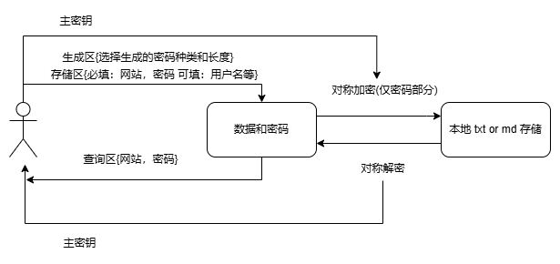
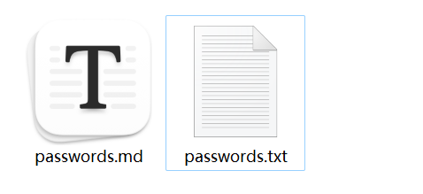
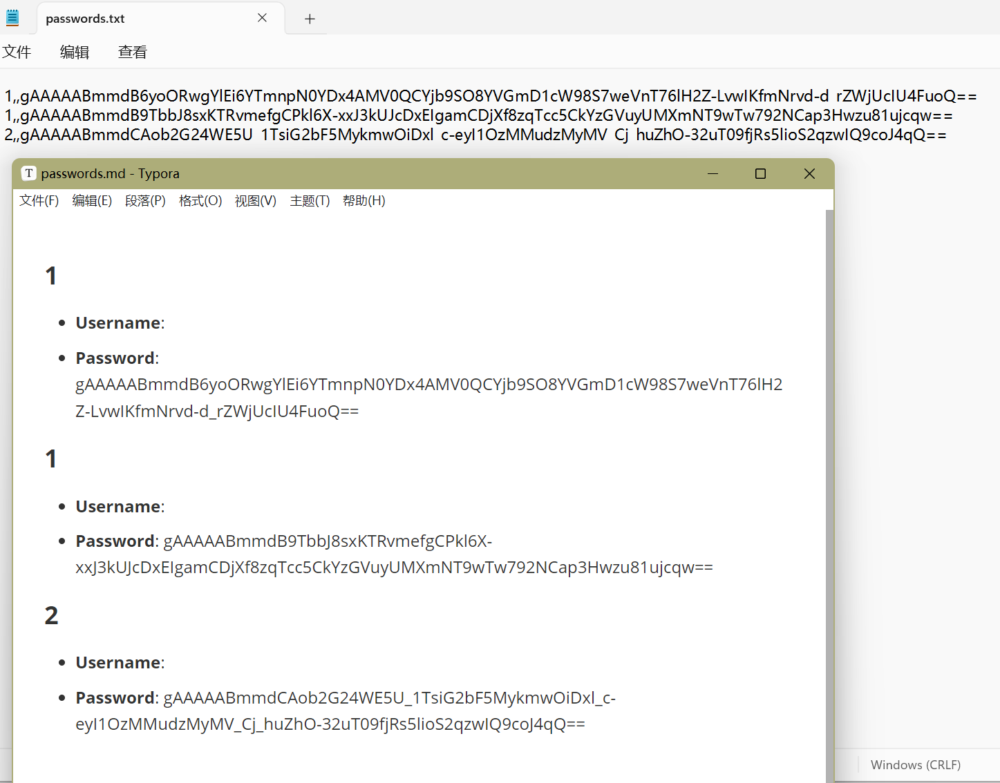
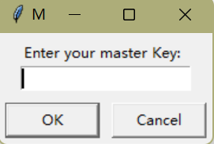
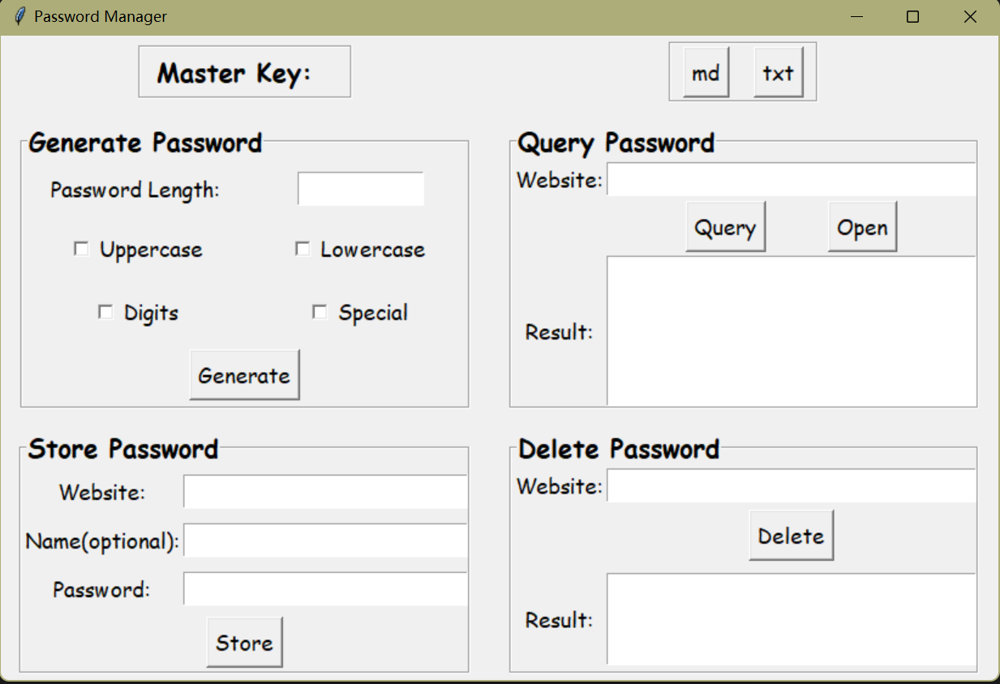

# password_manager
为了改掉我很多网站都用同一个密码的陋习，写了一个本地密码管理器，大概是这样的一个流程。用起来也很简单，迁移到其他电脑也简单，感觉对我来说还是挺有用的。

#### 保存位置和格式：

`home_dir = os.path.expanduser('~')`

`SAVE_DIR = os.path.join(home_dir, 'password_person')`

保存位置，比如在windows下面保存位置为(迁移的话把文件夹复制到新电脑上就可以了)

`C:\Users\Username\password_person`。其中Username为你的用户名。生成两个文件来保存，存储在里面的密码都是经过加密后的密文，没有主密钥是不能解密的。如果忘了网址内容，建议打开md进行查看，因为md格式好很多。格式分别是大标题网址，用户名，密码。

#### 使用方法：

可以把代码拷贝下来，运行`main.py`（然后创建一个快捷方式到桌面，感觉如果有python环境更方便一点）。也可以下载`exe`运行。运行后首先输入主密钥，主密钥是最重要的，就相当于你一个密码来产生其他的密码，当然你也可以每次使用不同的主密钥，只要你记得住就行。

输入完后进入会给你把你输入的密钥贴在上面，可以确认一下有没有输错。

##### 功能一：随机产生密码，产生好密码后自动填写到保存密码的框中。

##### 功能二：保存密码，产生好密码后加密保存到本地文件中，其中网址必填，用户名可填。

##### 功能三：查询密码，输入网址进行查询，网址相当于主键。记得注意的是，如果你网址存储密码时的主密钥和查询时候的主密钥不一样，你就无法查询到这个网址的密码，会显示无效的密钥。当然也是支持一次查询这个网址的多个账号的。Open按键会在旁边新生成一个比较大的框显示密码。

##### 功能四：删除密码，根据输入的网址进行删除，为防止误删，需要输入完整的网址名和和存储网址时的相同的主密钥才会删除。

#### Doned list:

- [x] 查询搜索算法优化：支持输入网址中的一部分搜索。（以符号为间隔，如 https://github.com/muzi-xiaoren 的关键词为{https,github,com,muzi-xiaoren}）
- [x] 删除网址需要密钥正确。
- [x] 界面美化。
- [x] Generate旁边增加Default选择所有选项的按钮，并默认生成长度为20的密码。
- [x] 按钮绑定回车键，便于操作。

#### To do list:

- [ ] 输入主密钥，一键导出所有主密钥能解密的网站和密码。
- [ ] 打包备份，迁移到其他电脑读取备份。（因为可以手动迁移，可能会鸽掉。）
- [ ] 优化算法，减少加解密次数。
- [ ] 窗口内快捷更换主密钥。

环境命令：`pip install -r requirements.txt`

构建exe的命令：`pyinstaller --onefile -i tb.ico --windowed main.py -p data_crypto.py -p file_stream.py -p gui.py -p password_generate.py`
